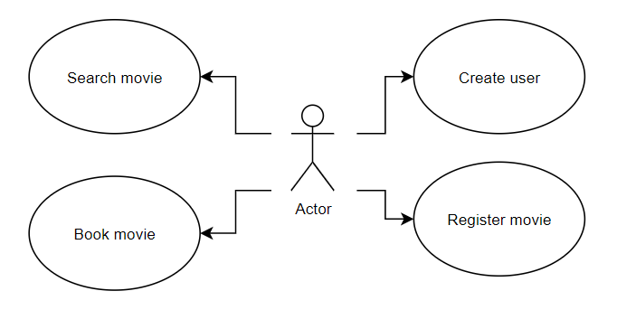
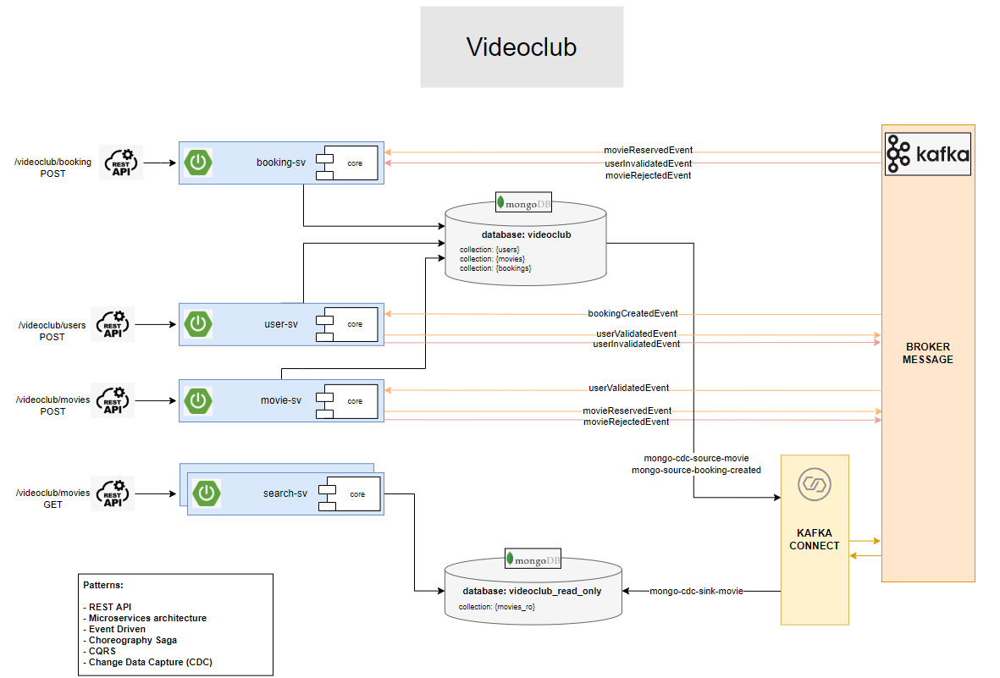

# eda-videoclub project

## Use cases diagram

## Architecture diagram

## How to deploy
1. Run ``mvn -B clean package`` in every component (core and services)
2. Run ``docker-compose up``
3. Load source and sink kafka-connectors via Landoop Kafka Development Environment or via Kafka Connect API with Postman

## Important URLs
* **Kafka cluster source code:** https://github.com/lensesio/fast-data-dev
* **Kafka cluster image:** https://hub.docker.com/r/landoop/fast-data-dev/dockerfile
* **Kafka cluster UI:** http://localhost:3030/
* **MongoDb connector:** https://www.confluent.io/hub/mongodb/kafka-connect-mongodb
* **Mongo Express UI:** http://localhost:9090/db/videoclub/
* **Swagger UI:** http://localhost:{INSTANCE_PORT}/swagger-ui/index.html
