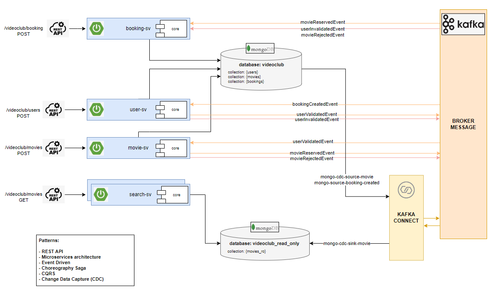

# eda-videoclub project

## Use cases diagram

## Sequence flow diagrams

## Architecture diagram

## Design description

Eda-videoclub project has been designed thinking in most of the maintenability, scalability and high-availability principles:

* By working with a microservices architecture we can ensure that the development teams are distributed and **specialized** only in some parts of the solution, we maintain a **loose coupled** solution and we can **scale** the most demanded microservice as well.

* Designing an event-driven architecture we increase **resilience** because it reduces dependencies between applications. If a particular service fails, it can autonomously restart, recover events, and/or replay them if needed. For instance, if an application experiences heavy traffic, we can store the excess requests in the queue so that no data will be lost.

* Choreography Saga pattern provide a **loose coupled** flow because each step does not need to know the previous and next step. Only the input and output messages. And we control the **distributed transactionality** with this pattern too.

* By using distributed systems such as databases or message-brokers we provide strong **reliability** in terms of failures as opposed to single systems. Even in the case of a single node malfunctioning, it does not pose problems to the remaining servers. Other nodes can continue to function fine. 

* CQRS design pattern separate write behavior from read behavior providing stability and scalability while also improving overall **performance**.

* One of the most frequent problems when using databases and events is to maintain **transactionality** between the two. What if we need to persist data and send a message but we cannot know it has been sent? Then we can use the Change Data Capture (CDC) pattern as an innovative mechanism for Data Integration. It is a technology for efficiently reading the changes made to a source (Database) and applying those to a target (Message Broker).

* Finally, using a REST API as a gateway **simplifies** communication with our application by providing an interface **programming-language-independent**.

## Stack

* Java 11
* Apache-Maven 3.8.4
* Spring Boot 2.7.2
* MongoDb
* Kafka
* Kafka Connect
* Docker
* Postman
* JMeter 5.5

## How to deploy
1. Run ``mvn -B clean install`` in core and service components
2. Run ``docker-compose up``
3. Load source and sink kafka-connectors via [Landoop Kafka Development Environment](http://localhost:3030/) or via Kafka Connect API using Postman collection
4. Run Postman requests or JMeter plan

## Important URLs
* **Kafka cluster UI:** http://localhost:3030/
* **Mongo Express UI:** http://localhost:9090/db/videoclub/

## Documentation
* **Kafka cluster source code:** [https://github.com/lensesio/fast-data-dev](https://github.com/lensesio/fast-data-dev)
* **Kafka cluster image:** [https://hub.docker.com/r/landoop/fast-data-dev/dockerfile](https://hub.docker.com/r/landoop/fast-data-dev/dockerfile)
* **Kafka connect REST API:** [https://docs.confluent.io/platform/current/connect/references/restapi.html#kconnect-cluster](https://docs.confluent.io/platform/current/connect/references/restapi.html#kconnect-cluster)
* **MongoDb connector:** [https://www.confluent.io/hub/mongodb/kafka-connect-mongodb](https://www.confluent.io/hub/mongodb/kafka-connect-mongodb)
* **Choreography-based saga:** https://microservices.io/patterns/data/saga.html
